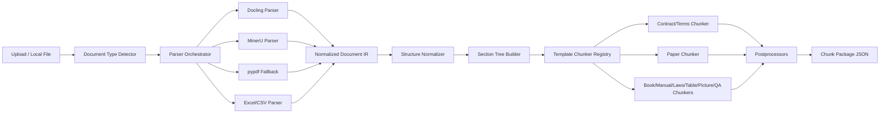

# ChunkFlow 文档理解与切片架构设计

状态：Draft  
日期：2026-04-28  
范围：只覆盖文档理解和切片，不实现检索、rerank、问答和 citation pipeline。  
定位：ChunkFlow 继续保持轻量解析和切片服务，借鉴 RAGFlow 的分层、模板化和 layout-aware 思路。

## 1. 背景

当前 ChunkFlow 已有 Docling、MinerU、pypdf 三路 PDF 解析能力，并能输出单层 `chunks`。现有实现的优点是简单、易运行，但 `chunkflow/chunking.py` 同时承担了解析调度、结构修复、切片和后处理，数据模型也主要围绕最终 chunk 设计，导致后续加入版面坐标、表格上下文、章节级 parent-child、文档类型模板时会越来越难维护。

RAGFlow 的可借鉴点主要有三类：

- `deepdoc/parser/*` 侧重把复杂格式解析成结构化内容，包括 PDF、Docx、Excel、图片、OCR、表格、版面等。
- `rag/app/*` 按用途提供 chunking 模板，例如 naive、manual、paper、book、laws、qa、table、picture、presentation、one。
- `rag/nlp/*` 提供 token 化、层级合并、标题识别、表格/图片上下文挂接等 chunk 后处理能力。

本设计不是把 RAGFlow 整套 RAG 系统搬进 ChunkFlow，而是将其中“parser 负责结构化抽取，chunker 负责按用途切分”的边界移植到 ChunkFlow，并把输出做成后续可扩展 citation 和 retrieval 的结构化包。

参考来源：

- [RAGFlow GitHub 仓库](https://github.com/infiniflow/ragflow)
- [RAGFlow `rag/app` 模板目录](https://github.com/infiniflow/ragflow/tree/main/rag/app)
- [RAGFlow `deepdoc/parser` 解析目录](https://github.com/infiniflow/ragflow/tree/main/deepdoc/parser)
- [RAGFlow Apache-2.0 License](https://github.com/infiniflow/ragflow/blob/main/LICENSE)
- [RAGFlow chunking methods overview](https://deepwiki.com/infiniflow/ragflow/6.2-graphrag-integration)

## 2. 设计目标

1. 解析和切片分层：parser 只产出结构化 IR，chunker 只消费 IR 并按模板切片。
2. 文档类型模板化：保险条款/合同、论文、书籍、技术手册、法律法规、表格型文件、图片型 PDF、问答文档分别走不同 chunker。
3. layout-aware PDF parsing：保留页码、坐标、标题层级、表格、图片、caption、阅读顺序。
4. table/image text context window：表格和图片 chunk 携带周边文本上下文，但本阶段不保存截图和图片 crop。
5. parent-child chunking：以章节级 parent 为主，小块 child 面向未来召回，大块 parent 面向未来回答。
6. citation-ready metadata：预留 chunk ID、block ID、页码、坐标和来源 block 关系，但不做答案句到来源 chunk 的匹配。
7. 轻量服务：不引入向量库、ES、rerank 服务和完整 RAG orchestration。
8. 不要求保持旧 `/api/parse` 输出兼容，可以直接升级为新结构。

非目标：

- 不做 hybrid retrieval、rerank、embedding、索引写入。
- 不做问答生成和答案溯源 pipeline。
- 不做 PDF 前端坐标高亮和截图预览。
- 不复制 RAGFlow 的所有依赖和服务。

## 3. 总体架构



核心思想：

- Parser 输出的是统一 `ParsedDocument`，而不是直接输出 chunk。
- Chunker 根据 `document_type` 从统一 IR 中选择适合的结构切分策略。
- Postprocessor 统一处理 parent-child、table/image 上下文、跨页断裂修复、稳定 ID 和质量校验。

## 4. 目标模块结构

建议改造成以下目录：

```text
chunkflow/
  api/
    app.py
    schemas.py
  core/
    pipeline.py
    document_type.py
    ids.py
    tokenizer.py
  ir/
    models.py
    normalize.py
    section_tree.py
    validators.py
  parsers/
    base.py
    docling_pdf.py
    mineru_pdf.py
    pypdf_fallback.py
    table_file.py
    text_file.py
  chunkers/
    base.py
    registry.py
    contract_terms.py
    paper.py
    book.py
    manual.py
    laws.py
    table_data.py
    picture_pdf.py
    qa.py
  postprocess/
    boundary_repair.py
    media_context.py
    parent_child.py
    small_chunk_merge.py
    quality.py
```

迁移时不必一次性移动全部文件。第一阶段可以保留现有 `docling_parser.py`、`mineru_parser.py`、`pdf_parser.py`，先增加 adapter，把它们的输出规范化到 IR。

## 5. 数据模型

### 5.1 ParsedDocument

`ParsedDocument` 是 parser 层的唯一输出，也是 chunker 层的唯一输入。

```python
class ParsedDocument:
    document_id: str
    source_path: str
    filename: str
    file_type: str
    document_type: str | None
    parser_used: str
    parser_fallback_chain: list[str]
    pages: list[Page]
    blocks: list[Block]
    section_tree: list[SectionNode]
    tables: list[TableBlock]
    figures: list[FigureBlock]
    parse_report: ParseReport
```

### 5.2 Page

```python
class Page:
    page_number: int
    width: float | None
    height: float | None
    rotation: int | None
    block_ids: list[str]
```

### 5.3 Block

`Block` 是最小的可定位结构单元。所有 chunk 都必须能追溯到一个或多个 block。

```python
class Block:
    block_id: str
    document_id: str
    page_number: int
    block_type: str
    text: str
    html: str | None
    markdown: str | None
    bbox: BBox | None
    reading_order: int
    heading_path: list[str]
    section_id: str | None
    caption: str | None
    confidence: float | None
    metadata: dict
```

`block_type` 建议使用固定枚举：

- `title`
- `heading`
- `paragraph`
- `list_item`
- `table`
- `figure`
- `caption`
- `formula`
- `header`
- `footer`
- `footnote`
- `page_number`
- `unknown`

### 5.4 SectionNode

```python
class SectionNode:
    section_id: str
    parent_section_id: str | None
    title: str
    level: int
    page_start: int
    page_end: int
    block_ids: list[str]
```

### 5.5 ChunkPackage

`ChunkPackage` 是 API 返回结果。

```python
class ChunkPackage:
    document_id: str
    document_type: str
    parser_used: str
    chunker_used: str
    parent_chunks: list[ParentChunk]
    child_chunks: list[ChildChunk]
    blocks: list[Block]      # 可按 include_blocks 参数裁剪
    parse_report: ParseReport
    warnings: list[str]
```

### 5.6 ParentChunk 和 ChildChunk

章节级 parent 是本设计的默认 parent 粒度。

```python
class ParentChunk:
    parent_id: str
    document_id: str
    section_id: str
    heading_path: list[str]
    title: str
    text: str
    page_span: tuple[int, int]
    source_block_ids: list[str]
    child_chunk_ids: list[str]
```

```python
class ChildChunk:
    chunk_id: str
    parent_id: str
    document_id: str
    chunk_type: str
    template: str
    text: str
    page_span: tuple[int, int]
    source_block_ids: list[str]
    bbox_refs: list[BBoxRef]
    heading_path: list[str]
    context_before: str | None
    context_after: str | None
    token_count: int
    metadata: dict
```

`bbox_refs` 只用于预留 citation 和前端定位，不在本阶段做截图和答案映射。

## 6. Parser 层设计

### 6.1 ParserOrchestrator

`ParserOrchestrator` 根据文件类型、用户参数和自动检测结果选择 parser：

1. PDF 默认优先 Docling。
2. 表格密集、扫描件、图片型 PDF 可切换到 MinerU。
3. Docling/MinerU 失败时回退 pypdf。
4. Excel/CSV 走 `TableFileParser`。
5. txt/md 走 `TextFileParser`。

建议参数：

```text
parser=auto|docling|mineru|pypdf|table|text
template=auto|contract_terms|paper|book|manual|laws|table_data|picture_pdf|qa
layout_detail=full|basic|none
```

### 6.2 DoclingPdfParser

用途：

- 默认 PDF parser。
- 用于普通文本型 PDF、合同、条款、论文、书籍、手册、法律法规。

需要从 Docling 输出提取并规范化：

- 页码。
- block 类型。
- heading path。
- reading order。
- table markdown/html。
- figure/caption 文本。
- bbox，若 Docling 当前输出可得。

### 6.3 MinerUPdfParser

用途：

- 表格密集 PDF。
- 扫描件或 OCR 质量要求高的 PDF。
- 图片型 PDF。

需要增强当前 `mineru_parser.py` 的 normalize：

- 不要直接产出 chunk，而是产出 `Block`。
- 保留 MinerU `content_list` 中的 page、type、bbox、table caption、table body、figure caption。
- 表格转换为 markdown，同时保留原始 html/json。
- 图片和表格旁边的 caption 归一为 `caption` 或相邻 block。

### 6.4 pypdfFallbackParser

用途：

- 依赖缺失或高精度 parser 失败时兜底。

限制：

- 只能提供弱 layout。
- bbox 为空。
- block 主要来自页内段落、标题正则和列表正则。

输出仍必须满足 IR 约束，便于后续 chunker 不关心 parser 来源。

## 7. 文档类型识别

支持显式指定和自动识别。显式指定优先。

自动识别信号：

- 文件扩展名：PDF、xlsx、csv、txt、md。
- 标题/正文关键词：保险、合同、条款、责任免除、释义、Article、Chapter、Abstract、References、Troubleshooting 等。
- heading 结构：章节、条、款、项、论文标准 section。
- block 统计：表格占比、图片占比、OCR block 占比。
- 文件名关键词。

优先级按用户指定：

1. `contract_terms`：保险条款/合同。
2. `paper`：论文。
3. `book`：书籍。
4. `manual`：技术手册。
5. `laws`：法律法规。
6. `table_data`：表格型 Excel/CSV。
7. `picture_pdf`：图片型 PDF。
8. `qa`：问答文档。

当自动识别置信度不足时，使用 `contract_terms` 或 `manual` 不应被强行套用，应回退 `generic_structured`。但第一版可以不暴露 generic 模板，只在内部走保守段落切分。

## 8. Template Chunker 设计

### 8.1 ContractTermsChunker

优先实现。

适用：

- 保险条款。
- 合同。
- 用户当前测试集中类似条款结构的 PDF。

策略：

- 以章、条、款、项构造 section tree。
- parent 粒度为章或一级大节。
- child 粒度优先按条款完整语义切分。
- 对定义、责任、免责、等待期、给付条件等标题保留 heading path。
- 跨页列表项合并，避免把一个条款列表拆断。
- 表格作为独立 child，不和正文硬合并。
- 表格 child 附带所在条款标题、前后若干 block 文本。

默认参数：

```text
child_max_tokens=450
child_min_tokens=80
parent_granularity=chapter
table_context_blocks=2
image_context_blocks=2
```

### 8.2 PaperChunker

适用：

- 学术论文 PDF。

策略：

- title、authors、abstract 独立识别。
- abstract 作为完整 child，不拆。
- sections 按论文 heading 分组。
- references 可配置是否保留，默认保留但降低优先级标记。
- tables/figures 独立 child，并挂接 caption 和周边文本。
- parent 粒度为一级 section。

### 8.3 BookChunker

适用：

- 书籍、长文档。

策略：

- 尝试移除目录页或目录 block。
- parent 为 chapter。
- child 按 section、自然段和 token budget 合并。
- 保留前言、附录、索引等特殊 section 标记。
- 对超长 section 做二级切分，但仍挂同一个 chapter parent。

### 8.4 ManualChunker

适用：

- 技术手册、操作手册、维修文档。

策略：

- parent 为 chapter 或功能模块。
- child 优先保持 procedure、warning、note、troubleshooting table 的完整性。
- 列表步骤不要被切断。
- 表格上下文必须包含所在小节标题和相邻说明。
- 故障诊断表可以按行组或完整表切分，取决于 token 大小。

### 8.5 LawsChunker

适用：

- 法律法规、监管文件、规章制度。

策略：

- 建立章、节、条、款、项树。
- parent 为章或节。
- child 通常为一条或若干连续条。
- 条号、款号、项号进入 metadata，不只作为正文。
- 绝不把条号和正文分离。

### 8.6 TableDataChunker

适用：

- Excel、CSV、TSV。
- PDF 中抽出的纯表格也可以调用同一套 row/group 策略。

策略：

- sheet/table 为 parent。
- child 为一行、若干行或逻辑 row group。
- 每个 child 文本都带列名。
- 保留 sheet name、header rows、字段类型、row range。
- 宽表按列组切分，长表按行组切分。

### 8.7 PicturePdfChunker

适用：

- 扫描件。
- 图片型 PDF。

策略：

- MinerU 优先。
- 页面级 parent。
- child 来自 OCR block、caption、figure 说明。
- 若一页 OCR 文本过少，可整页作为 child。
- 图片本体不保存为 chunk 内容，只保留 `[figure] caption/context` 形式的文本说明。

### 8.8 QAChunker

适用：

- FAQ、问答对文档。

策略：

- 每个 Q-A 对为一个 child。
- category/section 为 parent。
- 问题进入 `metadata.question`，答案进入正文。
- 多轮问答保留顺序。

## 9. Parent-Child Chunking

本项目默认采用章节级 parent：

- parent 代表完整章节或一级 section。
- child 代表可检索的小语义块。
- child 必须有 `parent_id`。
- parent 必须有 `child_chunk_ids`。

构造流程：

1. 从 heading block 和正则规则构建 section tree。
2. 按模板选择 parent level。
3. 将 section 内 block 聚合为 parent text。
4. 在 parent 范围内按模板生成 child。
5. 对 child 进行 token 控制和边界修复。
6. 写入双向引用。

建议 parent text 不做过度 token 限制，因为它面向未来回答；如果章节极长，可以设置软上限并拆成 `parent_part_index`。

## 10. Table/Image Context Window

本阶段只做文本上下文，不保存截图。

对 `table`、`figure`、`caption` 类型 child 添加：

```python
context_before: str | None
context_after: str | None
metadata: {
    "context_block_ids_before": [...],
    "context_block_ids_after": [...],
    "caption_block_ids": [...],
}
```

上下文选择规则：

1. 优先同一 section。
2. 其次同一页阅读顺序前后 block。
3. 默认前后各 2 个有效文本 block。
4. 跳过 header、footer、page_number。
5. 不跨越新的一级标题。
6. 若 caption 与 table/figure 相邻，caption 永远附加。

输出文本建议格式：

```text
Heading: 第五条 保险责任
Context before:
...
Table:
| ... |
Context after:
...
```

## 11. 后处理和质量校验

统一 postprocessors：

- `boundary_repair`：修复跨页断句、跨页列表、中文标点开头等问题。
- `small_chunk_merge`：合并孤儿小块，但 table/figure 不参与普通正文合并。
- `media_context`：为 table/figure/caption 挂接上下文。
- `parent_child`：建立 parent-child 关系。
- `stable_ids`：基于 document_id、section_id、block_ids、chunk_index 生成稳定 ID。
- `quality`：输出 warnings 和 metrics。

必须校验的 invariants：

- 每个 child 至少引用一个 source block。
- 每个 child 都有 parent。
- page_span 与 source block 页码一致。
- table/figure child 不被普通段落合并吞掉。
- heading_path 不为空时必须来自 section tree 或 parser heading。
- block reading_order 在页内单调。
- 同一 document 内 chunk_id 唯一。

质量指标：

- chunk_count。
- parent_count。
- orphan_child_count。
- chunks_without_page_count。
- chunks_without_source_block_count。
- table_context_coverage。
- avg_tokens_per_child。
- over_max_token_child_count。

## 12. API 设计

### 12.1 `POST /api/parse`

请求参数：

```text
parser=auto|docling|mineru|pypdf
template=auto|contract_terms|paper|book|manual|laws|table_data|picture_pdf|qa
parent_granularity=chapter
child_max_tokens=450
child_min_tokens=80
table_context_blocks=2
image_context_blocks=2
include_blocks=true|false
layout_detail=full|basic|none
```

返回示例：

```json
{
  "document_id": "...",
  "filename": "sample.pdf",
  "document_type": "contract_terms",
  "parser_used": "docling",
  "parser_fallback_chain": ["docling"],
  "chunker_used": "contract_terms",
  "parent_chunks": [],
  "child_chunks": [],
  "blocks": [],
  "parse_report": {
    "page_count": 12,
    "block_count": 380,
    "table_count": 4,
    "figure_count": 2,
    "warnings": []
  },
  "warnings": []
}
```

### 12.2 `GET /api/templates`

返回支持的模板、默认参数和适用文档类型，便于前端选择。

### 12.3 `GET /api/status`

保留现有能力，但扩展 parser 和 chunker 可用性：

```json
{
  "service": "ChunkFlow",
  "parsers": {
    "docling": true,
    "mineru": true,
    "pypdf": true
  },
  "templates": [
    "contract_terms",
    "paper",
    "book",
    "manual",
    "laws",
    "table_data",
    "picture_pdf",
    "qa"
  ]
}
```

## 13. 实施路线

### Phase 1：IR 和分层管线

目标：先拆边界，不追求所有模板一次到位。

- 新增 `ir/models.py`。
- 新增 parser adapter，把 Docling、MinerU、pypdf 输出转成 `ParsedDocument`。
- 新增 `core/pipeline.py`：`parse -> normalize -> section_tree -> chunk -> postprocess`。
- 新增 `chunkers/base.py` 和 `chunkers/registry.py`。
- 先实现 `contract_terms` 和 `generic_structured`。
- `/api/parse` 改为返回 `ChunkPackage`。

验收：

- 当前测试 PDF 能输出 parent_chunks、child_chunks、blocks。
- 每个 child 有 parent 和 source_block_ids。
- 表格 chunk 不和正文合并。

### Phase 2：Layout-aware 增强

目标：尽量接近 RAGFlow 的 layout-aware 输出。

- Docling adapter 提取 bbox、page size、block type、heading path。
- MinerU adapter 保留 content_list 中的 bbox、table、caption、figure 信息。
- 坐标统一为 PDF page coordinate，并记录 `coordinate_system`。
- 增加 table/image text context window。
- 增加 IR validators 和 quality metrics。

验收：

- PDF chunk 能追溯页码和 block bbox。
- table/image child 有上下文。
- 扫描件 PDF 可以用 MinerU 路线输出 OCR block。

### Phase 3：核心模板

目标：覆盖优先级最高的业务文档。

- 完善 `contract_terms`。
- 新增 `paper`。
- 新增 `laws`。
- 新增 `manual`。

验收：

- 保险条款按章、条、款、项稳定切分。
- 论文 abstract 不被拆断。
- 法规条号不与正文分离。
- 手册步骤列表和故障表不被切断。

### Phase 4：扩展模板

目标：覆盖剩余类型。

- 新增 `book`。
- 新增 `table_data`，支持 xlsx/csv。
- 新增 `picture_pdf`。
- 新增 `qa`。

验收：

- Excel/CSV 可按 sheet/table/row group 输出。
- 图片型 PDF 走 MinerU 或 OCR 输出文本 chunk。
- QA 文档按问答对切分。

### Phase 5：可观测和测试集

目标：让切片质量可回归。

- 为每类文档准备 golden JSON。
- 添加 chunk invariants 单元测试。
- 添加 parser fallback 测试。
- 添加 table/image context window 测试。
- 前端展示 parent-child、block 来源和 warnings。

## 14. 与现有代码的迁移关系

当前文件迁移建议：

- `chunkflow/schema.py`：保留旧模型一段时间，新增 IR 模型后逐步替换。
- `chunkflow/chunking.py`：拆成 `core/pipeline.py`、`postprocess/*`、`chunkers/*`。
- `chunkflow/docling_parser.py`：改为 `parsers/docling_pdf.py` 的 adapter。
- `chunkflow/mineru_parser.py`：改为 `parsers/mineru_pdf.py` 的 adapter，保留 MinerU API 调用代码。
- `chunkflow/pdf_parser.py`：保留清洗和 fallback 逻辑，逐步移动到 `parsers/pypdf_fallback.py` 和 `postprocess/boundary_repair.py`。
- `static/app.js`：后续改为展示 parent-child 和 warnings，不再假设单层 chunks。

第一阶段可以通过 adapter 降低风险，不必立即删除旧文件。

## 15. 风险和约束

1. RAGFlow 的 DeepDoc 是完整视觉解析栈，ChunkFlow 若只依赖 Docling/MinerU，很难在所有 PDF 上完全一致。
2. Docling、MinerU、pypdf 的 block 类型和坐标体系不同，必须做 normalize，否则后续 citation-ready metadata 会不稳定。
3. 当前仓库部分中文文本显示为乱码，应在实施前确认文件编码和测试样本编码，避免正则规则继续基于乱码字符串演进。
4. MinerU 依赖外部 API token 和网络，必须有 pypdf/Docling fallback。
5. 不保持旧 API 兼容会简化设计，但前端和测试需要同步升级。
6. 允许借鉴 RAGFlow 代码时，需要保留 Apache-2.0 许可说明和必要 attribution。

## 16. 建议优先级

推荐先做：

1. `ParsedDocument` IR。
2. Docling/MinerU/pypdf adapter。
3. `contract_terms` chunker。
4. 章节级 parent-child。
5. table/image text context。
6. quality validators。

原因：这组改造能最快解决当前 ChunkFlow 的核心结构问题，也最贴近用户当前优先文档类型：保险条款/合同。

第二批再做：

1. `paper`。
2. `laws`。
3. `manual`。
4. bbox 完整归一。

第三批再做：

1. `book`。
2. `table_data`。
3. `picture_pdf`。
4. `qa`。

## 17. 最小可落地版本

MVP 不需要一次实现全部设计。建议定义为：

- 输入 PDF。
- parser 支持 Docling、MinerU、pypdf fallback。
- 输出 `ParsedDocument.blocks`。
- 支持 `contract_terms` 和 `generic_structured` 两个 chunker。
- 输出章节级 `parent_chunks` 和 `child_chunks`。
- table child 带前后文本上下文。
- 每个 child 带 `source_block_ids`、`page_span`、`bbox_refs`。
- `/api/parse` 返回新 `ChunkPackage`。

这版完成后，ChunkFlow 的核心形态就已经从“PDF 文本切片器”升级为“轻量文档理解和模板化切片服务”。
